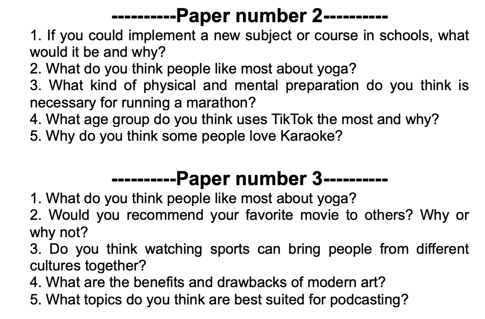

# ESL Exam Paper Generator

> Tools used:


<a href="https://github.com/fumiama/go-docx">

</a>


Exam paper generator is a tool to help you generate random exam papers with the questions you provide. This program can come in handy for ESL teachers looking to automate their exam/test preparation. It's also aimed at prevention of students copying each other's answers to the same questions. Unique paper = unique answers.

This tool utilizes [go-docx](https://github.com/fumiama/go-docx) library to create a well-stuctured output in **docx** format.

# How it works

The process to use the tool is pretty simple:

1. Place your questions separated by new lines into the `put-your-questions-here.txt`  file. 
2. If the file is not present, it will be recreated at runtime, so refer to **step 3**.
3. Run the executive `test-paper-generator` file in `bin` the folder.
4. Enter the amount of required test papers and questions in each paper.
5. Get your output in the resulting `questions.docx`  file.

## Input example

```
What kind of physical and mental preparation do you think is necessary for running a marathon?
What are the benefits and drawbacks of modern art?
What do you think we should do to start treating animals better?
What topics do you think are best suited for podcasting?
What do you think people like most about yoga?
What age group do you think uses TikTok the most and why?
Why do you think some people love Karaoke?
Would you recommend your favourite movie to others? Why or why not?
Do you think watching sports can bring people from different cultures together?
How has technology changed the way schools operate compared to the past?
If you could implement a new subject or course in schools, what would it be and why?
```


## Output example


